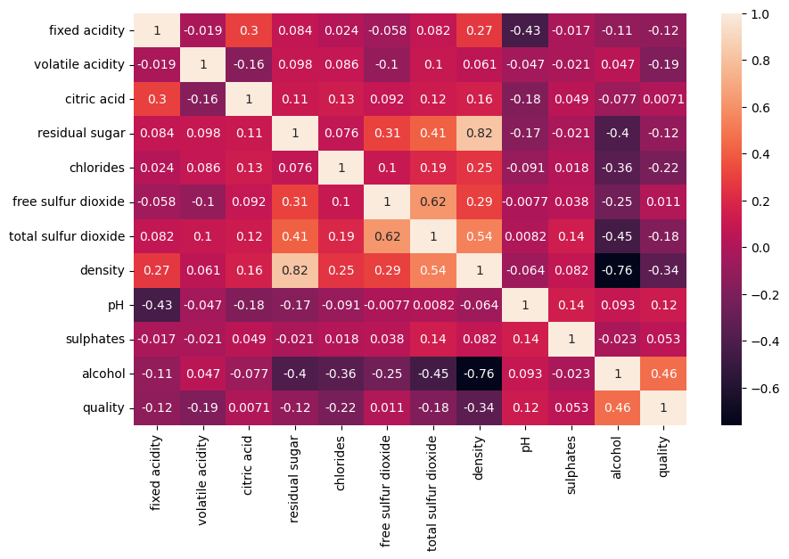
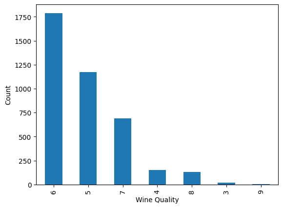
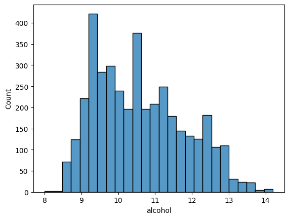
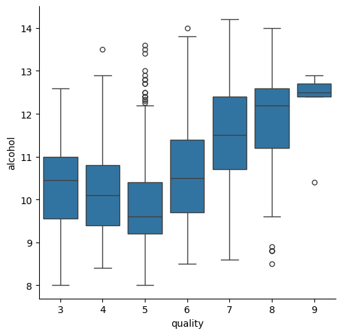
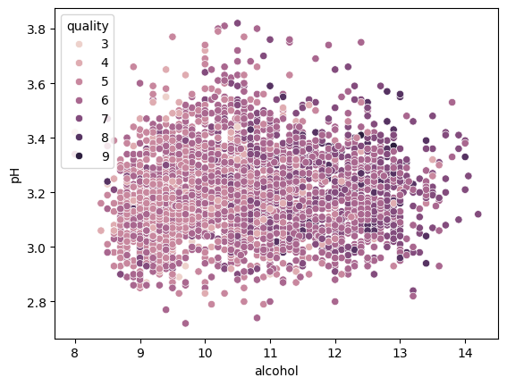

# Wine Quality Exploratory Data Analysis (EDA)

## Project Overview
This project performs exploratory data analysis on the Portuguese "Vinho Verde" white wine dataset to understand the relationships between physicochemical properties and wine quality ratings.

## Dataset Information
The dataset contains information about white wine variants of the Portuguese "Vinho Verde" wine. Due to privacy and logistic issues, only physicochemical (inputs) and sensory (output) variables are available.

### Features
**Input variables (based on physicochemical tests):**
1. **Fixed acidity** - Most acids involved with wine or fixed or nonvolatile
2. **Volatile acidity** - The amount of acetic acid in wine
3. **Citric acid** - Found in small quantities, can add 'freshness' and flavor
4. **Residual sugar** - The amount of sugar remaining after fermentation stops
5. **Chlorides** - The amount of salt in the wine
6. **Free sulfur dioxide** - Prevents microbial growth and wine oxidation
7. **Total sulfur dioxide** - Amount of free and bound forms of SO2
8. **Density** - Depends on alcohol and sugar content
9. **pH** - Describes how acidic or basic wine is on a scale from 0-14
10. **Sulphates** - Wine additive which can contribute to SO2 levels
11. **Alcohol** - Percent alcohol content of wine

**Output variable (based on sensory data):**
- **Quality** - Score between 0 and 10 (median of at least 3 evaluations)

## Project Structure
```
wine_quality_eda/
├── wine_quality_eda.ipynb    # Main Jupyter notebook with EDA
├── winequality-white.csv     # Dataset file
├── README.md                 # Project documentation
└── Plots/                    # Sample visualization outputs
    ├── correlation_heatmap.png
    ├── quality_distribution.png
    ├── feature_histograms.png
    └── other_visualizations.png
```

## Analysis Summary

### Data Exploration
- **Dataset size**: Initial dataset contains 4,898 records with 12 features
- **Data quality**: No missing values found
- **Duplicates**: Duplicate records identified and removed during preprocessing
- **Quality distribution**: Dataset is imbalanced with most wines rated 5-7

### Key Findings
1. **Correlation Analysis**: Created correlation heatmap to identify relationships between features
2. **Quality Distribution**: Most wines are rated between 5-7, indicating an imbalanced dataset
3. **Feature Distributions**: Analyzed univariate distributions for all features
4. **Relationships**: 
   - Explored alcohol content vs quality relationships
   - Analyzed pH vs alcohol content with quality as a factor
   - Performed multivariate analysis using pair plots

### Visualizations Created
- **Correlation Heatmap**: Shows relationships between all numeric features
- **Quality Distribution**: Bar chart showing the imbalanced nature of quality ratings
- **Feature Histograms**: Distribution plots for all features with KDE curves
- **Pair Plot**: Comprehensive multivariate analysis
- **Box Plots**: Quality vs alcohol content analysis
- **Scatter Plots**: Alcohol vs pH with quality color coding

## Sample Visualizations

### Correlation Heatmap

*Heatmap showing correlations between all wine features*

### Quality Distribution

*Bar chart demonstrating the imbalanced distribution of wine quality ratings*

### Feature Distributions

*Distribution plots for all physicochemical properties with density curves*

### Quality vs Alcohol Analysis

*Box plot showing alcohol content distribution across different quality ratings*

### pH vs Alcohol Relationship

*Scatter plot showing the relationship between pH and alcohol content, colored by quality*

## Technologies Used
- **Python 3.x**
- **Pandas** - Data manipulation and analysis
- **Matplotlib** - Basic plotting and visualization
- **Seaborn** - Statistical data visualization

## Getting Started

## Cloning the Repository
To clone this repository, run the following command in your terminal:
```bash
git clone https://github.com/SurajK221b/wine_quality_eda

### Prerequisites
```bash
pip install pandas matplotlib seaborn jupyter
```

### Running the Analysis
1. Clone or download this repository
2. Ensure the `winequality-white.csv` file is in the same directory
3. Open `wine_quality_eda.ipynb` in Jupyter Notebook or JupyterLab
4. Run all cells to execute the complete analysis

## Key Insights
- The dataset is suitable for both classification and regression tasks
- Quality ratings are not balanced, suggesting potential for outlier detection methods
- Strong correlations exist between certain physicochemical properties
- Alcohol content shows interesting relationships with wine quality
- Feature selection methods could be beneficial due to potential irrelevant variables

## Future Work
- **Classification Models**: Build models to predict wine quality categories
- **Regression Analysis**: Predict exact quality scores
- **Feature Engineering**: Create new features from existing ones
- **Outlier Detection**: Identify exceptional wines (very poor or excellent)
- **Feature Selection**: Determine most important factors for quality prediction

## Data Source
This dataset is part of the UCI Machine Learning Repository and relates to the Portuguese "Vinho Verde" wine certification process.

## Notes
- This analysis focuses only on white wine variants
- No information about grape types, wine brands, or selling prices is available
- Quality scores are based on sensory evaluation by wine experts
- The dataset can be used for both classification and regression problems

---

*This project demonstrates fundamental exploratory data analysis techniques for understanding wine quality factors through data visualization and statistical analysis.*
